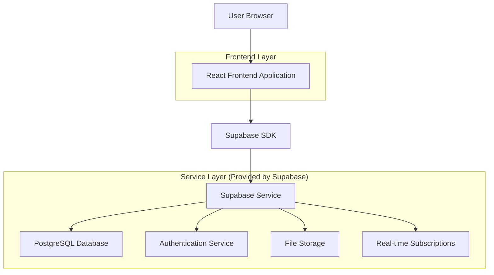
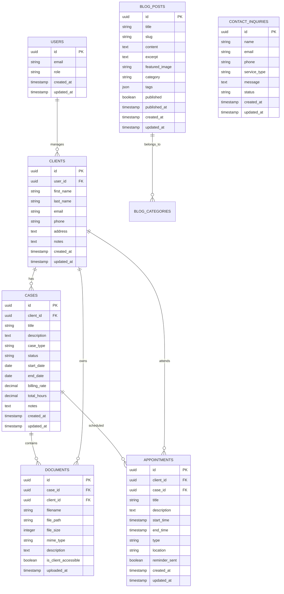

# Lawyer Web Application - Technical Architecture Document

## 1. Architecture Design



## 2. Technology Description

* Frontend: React\@18 + TypeScript + Tailwind CSS\@3 + Vite + React Router

* Backend: Supabase (Authentication, Database, Storage, Real-time)

* Additional Libraries: React Hook Form, React Query, Framer Motion, React Calendar

* Rich Text Editor: Tiptap or Quill.js

* File Upload: Supabase Storage with drag-and-drop interface

## 3. Route Definitions

| Route                | Purpose                                                            |
| -------------------- | ------------------------------------------------------------------ |
| /                    | Home page with hero section, services preview, and blog highlights |
| /about               | Lawyer biography, credentials, and professional background         |
| /services            | Detailed list of legal services offered                            |
| /blog                | Blog listing page with search and filtering capabilities           |
| /blog/:slug          | Individual blog post detail page                                   |
| /contact             | Contact information and consultation request form                  |
| /admin/login         | Admin authentication page                                          |
| /admin/dashboard     | Admin overview with analytics and quick actions                    |
| /admin/blog          | Blog post management interface                                     |
| /admin/blog/new      | Create new blog post                                               |
| /admin/blog/edit/:id | Edit existing blog post                                            |
| /admin/content       | Website content management                                         |
| /admin/calendar      | Calendar and appointment management                                |
| /admin/clients       | Client management interface                                        |
| /admin/clients/:id   | Individual client profile                                          |
| /admin/cases         | Case management dashboard                                          |
| /admin/cases/:id     | Individual case details                                            |
| /admin/documents     | Document management system                                         |
| /client/login        | Client portal authentication                                       |
| /client/dashboard    | Client portal overview                                             |
| /client/case         | Client's case information and updates                              |
| /client/documents    | Client's accessible documents                                      |

## 4. API Definitions

### 4.1 Core API

**Authentication**

```typescript
// Supabase handles authentication automatically
interface User {
  id: string;
  email: string;
  role: 'admin' | 'client';
  created_at: string;
  updated_at: string;
}
```

**Blog Management**

```typescript
interface BlogPost {
  id: string;
  title: string;
  slug: string;
  content: string;
  excerpt: string;
  featured_image?: string;
  category: string;
  tags: string[];
  published: boolean;
  published_at?: string;
  created_at: string;
  updated_at: string;
}
```

**Client Management**

```typescript
interface Client {
  id: string;
  user_id?: string; // Reference to auth user if they have portal access
  first_name: string;
  last_name: string;
  email: string;
  phone: string;
  address: string;
  notes?: string;
  created_at: string;
  updated_at: string;
}
```

**Case Management**

```typescript
interface Case {
  id: string;
  client_id: string;
  title: string;
  description: string;
  case_type: string;
  status: 'active' | 'closed' | 'pending';
  start_date: string;
  end_date?: string;
  billing_rate?: number;
  total_hours?: number;
  notes?: string;
  created_at: string;
  updated_at: string;
}
```

**Calendar/Appointments**

```typescript
interface Appointment {
  id: string;
  client_id?: string;
  case_id?: string;
  title: string;
  description?: string;
  start_time: string;
  end_time: string;
  type: 'consultation' | 'court' | 'meeting' | 'deadline';
  location?: string;
  reminder_sent: boolean;
  created_at: string;
  updated_at: string;
}
```

**Document Management**

```typescript
interface Document {
  id: string;
  case_id?: string;
  client_id?: string;
  filename: string;
  file_path: string;
  file_size: number;
  mime_type: string;
  description?: string;
  is_client_accessible: boolean;
  uploaded_at: string;
}
```

**Contact Inquiries**

```typescript
interface ContactInquiry {
  id: string;
  name: string;
  email: string;
  phone?: string;
  service_type: string;
  message: string;
  status: 'new' | 'contacted' | 'converted' | 'closed';
  created_at: string;
  updated_at: string;
}
```

## 5. Data Model

### 5.1 Data Model Definition



### 5.2 Data Definition Language

**Users Table (handled by Supabase Auth)**

```sql
-- Supabase automatically creates auth.users table
-- We'll create a profiles table to extend user data
CREATE TABLE profiles (
    id UUID REFERENCES auth.users(id) PRIMARY KEY,
    role VARCHAR(20) DEFAULT 'client' CHECK (role IN ('admin', 'client')),
    created_at TIMESTAMP WITH TIME ZONE DEFAULT NOW(),
    updated_at TIMESTAMP WITH TIME ZONE DEFAULT NOW()
);

-- Enable RLS
ALTER TABLE profiles ENABLE ROW LEVEL SECURITY;

-- Policies
CREATE POLICY "Users can view own profile" ON profiles FOR SELECT USING (auth.uid() = id);
CREATE POLICY "Admins can view all profiles" ON profiles FOR ALL USING (auth.jwt() ->> 'role' = 'admin');
```

**Clients Table**

```sql
CREATE TABLE clients (
    id UUID PRIMARY KEY DEFAULT gen_random_uuid(),
    user_id UUID REFERENCES auth.users(id),
    first_name VARCHAR(100) NOT NULL,
    last_name VARCHAR(100) NOT NULL,
    email VARCHAR(255) NOT NULL,
    phone VARCHAR(20),
    address TEXT,
    notes TEXT,
    created_at TIMESTAMP WITH TIME ZONE DEFAULT NOW(),
    updated_at TIMESTAMP WITH TIME ZONE DEFAULT NOW()
);

-- Enable RLS
ALTER TABLE clients ENABLE ROW LEVEL SECURITY;

-- Policies
CREATE POLICY "Admins can manage all clients" ON clients FOR ALL USING (auth.jwt() ->> 'role' = 'admin');
CREATE POLICY "Clients can view own data" ON clients FOR SELECT USING (auth.uid() = user_id);

-- Indexes
CREATE INDEX idx_clients_user_id ON clients(user_id);
CREATE INDEX idx_clients_email ON clients(email);
```

**Cases Table**

```sql
CREATE TABLE cases (
    id UUID PRIMARY KEY DEFAULT gen_random_uuid(),
    client_id UUID REFERENCES clients(id) ON DELETE CASCADE,
    title VARCHAR(255) NOT NULL,
    description TEXT,
    case_type VARCHAR(100),
    status VARCHAR(20) DEFAULT 'active' CHECK (status IN ('active', 'closed', 'pending')),
    start_date DATE NOT NULL,
    end_date DATE,
    billing_rate DECIMAL(10,2),
    total_hours DECIMAL(8,2) DEFAULT 0,
    notes TEXT,
    created_at TIMESTAMP WITH TIME ZONE DEFAULT NOW(),
    updated_at TIMESTAMP WITH TIME ZONE DEFAULT NOW()
);

-- Enable RLS
ALTER TABLE cases ENABLE ROW LEVEL SECURITY;

-- Policies
CREATE POLICY "Admins can manage all cases" ON cases FOR ALL USING (auth.jwt() ->> 'role' = 'admin');
CREATE POLICY "Clients can view own cases" ON cases FOR SELECT USING (
    client_id IN (SELECT id FROM clients WHERE user_id = auth.uid())
);

-- Indexes
CREATE INDEX idx_cases_client_id ON cases(client_id);
CREATE INDEX idx_cases_status ON cases(status);
CREATE INDEX idx_cases_start_date ON cases(start_date DESC);
```

**Appointments Table**

```sql
CREATE TABLE appointments (
    id UUID PRIMARY KEY DEFAULT gen_random_uuid(),
    client_id UUID REFERENCES clients(id),
    case_id UUID REFERENCES cases(id),
    title VARCHAR(255) NOT NULL,
    description TEXT,
    start_time TIMESTAMP WITH TIME ZONE NOT NULL,
    end_time TIMESTAMP WITH TIME ZONE NOT NULL,
    type VARCHAR(50) DEFAULT 'consultation' CHECK (type IN ('consultation', 'court', 'meeting', 'deadline')),
    location VARCHAR(255),
    reminder_sent BOOLEAN DEFAULT FALSE,
    created_at TIMESTAMP WITH TIME ZONE DEFAULT NOW(),
    updated_at TIMESTAMP WITH TIME ZONE DEFAULT NOW()
);

-- Enable RLS
ALTER TABLE appointments ENABLE ROW LEVEL SECURITY;

-- Policies
CREATE POLICY "Admins can manage all appointments" ON appointments FOR ALL USING (auth.jwt() ->> 'role' = 'admin');
CREATE POLICY "Clients can view own appointments" ON appointments FOR SELECT USING (
    client_id IN (SELECT id FROM clients WHERE user_id = auth.uid())
);

-- Indexes
CREATE INDEX idx_appointments_client_id ON appointments(client_id);
CREATE INDEX idx_appointments_case_id ON appointments(case_id);
CREATE INDEX idx_appointments_start_time ON appointments(start_time);
```

**Documents Table**

```sql
CREATE TABLE documents (
    id UUID PRIMARY KEY DEFAULT gen_random_uuid(),
    case_id UUID REFERENCES cases(id),
    client_id UUID REFERENCES clients(id),
    filename VARCHAR(255) NOT NULL,
    file_path VARCHAR(500) NOT NULL,
    file_size INTEGER NOT NULL,
    mime_type VARCHAR(100) NOT NULL,
    description TEXT,
    is_client_accessible BOOLEAN DEFAULT FALSE,
    uploaded_at TIMESTAMP WITH TIME ZONE DEFAULT NOW()
);

-- Enable RLS
ALTER TABLE documents ENABLE ROW LEVEL SECURITY;

-- Policies
CREATE POLICY "Admins can manage all documents" ON documents FOR ALL USING (auth.jwt() ->> 'role' = 'admin');
CREATE POLICY "Clients can view accessible documents" ON documents FOR SELECT USING (
    is_client_accessible = TRUE AND 
    client_id IN (SELECT id FROM clients WHERE user_id = auth.uid())
);

-- Indexes
CREATE INDEX idx_documents_case_id ON documents(case_id);
CREATE INDEX idx_documents_client_id ON documents(client_id);
CREATE INDEX idx_documents_uploaded_at ON documents(uploaded_at DESC);
```

**Blog Posts Table**

```sql
CREATE TABLE blog_posts (
    id UUID PRIMARY KEY DEFAULT gen_random_uuid(),
    title VARCHAR(255) NOT NULL,
    slug VARCHAR(255) UNIQUE NOT NULL,
    content TEXT NOT NULL,
    excerpt TEXT,
    featured_image VARCHAR(500),
    category VARCHAR(100),
    tags JSONB DEFAULT '[]',
    published BOOLEAN DEFAULT FALSE,
    published_at TIMESTAMP WITH TIME ZONE,
    created_at TIMESTAMP WITH TIME ZONE DEFAULT NOW(),
    updated_at TIMESTAMP WITH TIME ZONE DEFAULT NOW()
);

-- Enable RLS
ALTER TABLE blog_posts ENABLE ROW LEVEL SECURITY;

-- Policies
CREATE POLICY "Anyone can view published posts" ON blog_posts FOR SELECT USING (published = TRUE);
CREATE POLICY "Admins can manage all posts" ON blog_posts FOR ALL USING (auth.jwt() ->> 'role' = 'admin');

-- Indexes
CREATE INDEX idx_blog_posts_slug ON blog_posts(slug);
CREATE INDEX idx_blog_posts_published ON blog_posts(published, published_at DESC);
CREATE INDEX idx_blog_posts_category ON blog_posts(category);
CREATE INDEX idx_blog_posts_tags ON blog_posts USING GIN(tags);
```

**Contact Inquiries Table**

```sql
CREATE TABLE contact_inquiries (
    id UUID PRIMARY KEY DEFAULT gen_random_uuid(),
    name VARCHAR(255) NOT NULL,
    email VARCHAR(255) NOT NULL,
    phone VARCHAR(20),
    service_type VARCHAR(100),
    message TEXT NOT NULL,
    status VARCHAR(20) DEFAULT 'new' CHECK (status IN ('new', 'contacted', 'converted', 'closed')),
    created_at TIMESTAMP WITH TIME ZONE DEFAULT NOW(),
    updated_at TIMESTAMP WITH TIME ZONE DEFAULT NOW()
);

-- Enable RLS
ALTER TABLE contact_inquiries ENABLE ROW LEVEL SECURITY;

-- Policies
CREATE POLICY "Admins can manage all inquiries" ON contact_inquiries FOR ALL USING (auth.jwt() ->> 'role' = 'admin');
CREATE POLICY "Anyone can create inquiries" ON contact_inquiries FOR INSERT WITH CHECK (true);

-- Indexes
CREATE INDEX idx_contact_inquiries_status ON contact_inquiries(status);
CREATE INDEX idx_contact_inquiries_created_at ON contact_inquiries(created_at DESC);
```

**Initial Data**

```sql
-- Insert admin user profile (after admin user is created through Supabase Auth)
-- This would be done through the application after the first admin signs up

-- Insert sample blog categories and initial content
INSERT INTO blog_posts (title, slug, content, excerpt, category, published, published_at) VALUES
('Welcome to Our Legal Practice', 'welcome-to-our-legal-practice', 
 'Welcome to our law firm blog where we share insights on legal matters...', 
 'An introduction to our legal practice and what we offer to our clients.', 
 'General', TRUE, NOW()),
('Understanding Your Rights', 'understanding-your-rights', 
 'It is important to understand your legal rights in various situations...', 
 'A comprehensive guide to understanding your basic legal rights.', 
 'Legal Advice', TRUE, NOW());
```

