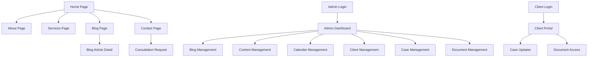

# Lawyer Web Application - Product Requirements Document

## 1. Product Overview
A comprehensive web application for a lawyer's practice featuring a public-facing website and an administrative dashboard. The public side serves as a professional landing page showcasing services, expertise, and blog content, while the admin side provides complete practice management capabilities.

The application aims to establish a strong online presence for the lawyer while streamlining administrative tasks and client management processes.

## 2. Core Features

### 2.1 User Roles
| Role | Registration Method | Core Permissions |
|------|---------------------|------------------|
| Public Visitor | No registration required | Can browse public content, contact form, read blog |
| Admin (Lawyer) | Direct login credentials | Full access to admin dashboard, content management, client data |
| Client | Email invitation from admin | Can access client portal, view case updates, documents |

### 2.2 Feature Module
Our lawyer web application consists of the following main sections:

**Public Side:**
1. **Home Page**: hero section with lawyer introduction, featured services, testimonials, recent blog posts
2. **About Page**: detailed lawyer biography, education, experience, certifications
3. **Services Page**: comprehensive list of legal services offered with descriptions
4. **Blog Page**: legal articles, news, insights with search and category filtering
5. **Contact Page**: contact form, office information, consultation booking

**Admin Side:**
6. **Admin Dashboard**: overview of cases, appointments, recent activities, analytics
7. **Blog Management**: create, edit, publish blog posts with rich text editor
8. **Content Management**: edit public website content, upload images, manage pages
9. **Calendar Management**: schedule appointments, court dates, deadlines with reminders
10. **Client Management**: client profiles, contact information, case assignments
11. **Case Management**: case details, documents, notes, status tracking, billing
12. **Document Management**: secure file storage, client document sharing

### 2.3 Page Details
| Page Name | Module Name | Feature description |
|-----------|-------------|---------------------|
| Home Page | Hero Section | Display lawyer's name, tagline, professional photo, call-to-action buttons |
| Home Page | Services Preview | Show 3-4 main practice areas with brief descriptions and links |
| Home Page | Testimonials | Client testimonials carousel with ratings and feedback |
| Home Page | Recent Blog Posts | Display latest 3 blog entries with titles, excerpts, and publication dates |
| About Page | Biography Section | Comprehensive lawyer profile including education, experience, achievements |
| About Page | Credentials | Display certifications, bar admissions, professional memberships |
| Services Page | Practice Areas | Detailed descriptions of all legal services offered with pricing information |
| Services Page | Service Inquiry | Contact form specific to each service for consultation requests |
| Blog Page | Article Listing | Paginated blog posts with search, category filter, and date sorting |
| Blog Page | Article Detail | Full blog post view with sharing options and related articles |
| Contact Page | Contact Form | Multi-field form with validation for consultation requests |
| Contact Page | Office Information | Address, phone, email, business hours, map integration |
| Admin Dashboard | Analytics Overview | Case statistics, website traffic, appointment summaries, revenue metrics |
| Admin Dashboard | Quick Actions | Shortcuts to create new case, add appointment, write blog post |
| Blog Management | Post Editor | Rich text editor with media upload, SEO fields, publish/draft options |
| Blog Management | Post Library | List all blog posts with search, filter, bulk actions |
| Content Management | Page Editor | Edit public website content with live preview functionality |
| Content Management | Media Library | Upload and manage images, documents, videos for website use |
| Calendar Management | Appointment Scheduler | Create, edit, delete appointments with client assignment and reminders |
| Calendar Management | Calendar View | Monthly/weekly/daily calendar views with drag-and-drop functionality |
| Client Management | Client Profiles | Store client contact info, case history, billing information, notes |
| Client Management | Client Portal Access | Generate secure login credentials for clients to access their information |
| Case Management | Case Details | Track case status, important dates, assigned clients, billing hours |
| Case Management | Case Documents | Upload, organize, and share case-related documents securely |
| Document Management | File Storage | Secure cloud storage with folder organization and access permissions |
| Document Management | Client Sharing | Share specific documents with clients through secure portal |

## 3. Core Process

**Public User Flow:**
Visitors land on the home page, browse services and about information, read blog posts for legal insights, and submit contact forms for consultation requests. The lawyer receives notifications for new inquiries and can follow up appropriately.

**Admin User Flow:**
The lawyer logs into the admin dashboard to view daily activities and case updates. They can create and publish blog content, manage website content, schedule appointments, add new clients and cases, upload documents, and track case progress. The system provides reminders for important dates and deadlines.

**Client User Flow:**
Clients receive secure login credentials to access their dedicated portal where they can view case updates, download shared documents, and communicate with the lawyer about their case status.

## 4. User Interface Design

### 4.1 Design Style
- **Primary Colors**: Deep navy blue (#1e3a8a) for trust and professionalism, gold accent (#f59e0b) for premium feel
- **Secondary Colors**: Light gray (#f8fafc) for backgrounds, dark gray (#374151) for text
- **Button Style**: Rounded corners with subtle shadows, hover effects with color transitions
- **Typography**: Professional serif font (Playfair Display) for headings, clean sans-serif (Inter) for body text
- **Layout Style**: Clean, minimalist design with ample white space, card-based components for content organization
- **Icons**: Professional line icons with consistent stroke width, legal-themed icons where appropriate

### 4.2 Page Design Overview
| Page Name | Module Name | UI Elements |
|-----------|-------------|-------------|
| Home Page | Hero Section | Full-width background image, centered text overlay, prominent CTA buttons with gold accent |
| Home Page | Services Preview | Three-column grid layout with icons, card-based design with hover effects |
| About Page | Biography | Two-column layout with professional headshot, timeline design for experience |
| Services Page | Practice Areas | Accordion-style expandable sections with detailed descriptions |
| Blog Page | Article Listing | Grid layout with featured images, excerpt previews, category tags |
| Contact Page | Contact Form | Single-column form with floating labels, integrated map with office location |
| Admin Dashboard | Analytics | Card-based widgets with charts and metrics, responsive grid layout |
| Admin Dashboard | Quick Actions | Floating action buttons with tooltips, sidebar navigation menu |
| Blog Management | Post Editor | Split-screen layout with editor on left, preview on right |
| Calendar Management | Calendar View | Full-screen calendar with color-coded appointments, modal popups for details |
| Client Management | Client Profiles | Tabbed interface with contact info, case history, and document sections |
| Case Management | Case Details | Multi-tab layout with case info, timeline, documents, and billing |

### 4.3 Responsiveness
The application is designed mobile-first with responsive breakpoints for tablet and desktop. Touch-friendly interface elements are optimized for mobile devices, with collapsible navigation menus and swipe gestures for content browsing. The admin dashboard adapts to smaller screens with stacked layouts and simplified navigation.
